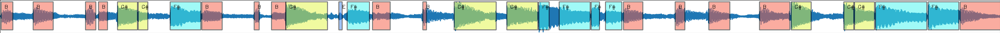

# bassNET

This is the repository wich contains the segmentation network designed and trained to segment the bass audio from a music audio.

## Dependencies

The external modules needed in this project are:

* torch
* torhcaudio
* pandas
* cv2
* numpy

## The model

This is a U-Net model trained to segment audio. To do so, tha audio needs to be reshaped to it`s spectogram. Then the model works as a filter mask wich filter every sound that is not a bass and outputs a spectogram

## Module API

**This module has a few functional methods**

First import the module

```
import bassNET 
```

Instanteate the neural network module

```
model = bassNET.model()
```

By default, the neural network is loaded in the computer GPU (if it is available) to increase segmentation speed. If we want to use it in CPU, I recommend to use

```
model = model.to('cpu')
```

The model, processes torch tensors. To facilitate this process, there is a load_audio function in this module

```
str_pathAudio = 'song.wav'
tensor_audio, int_sr = bassNET.load_audio(str_pathAudio)
```

With the audio loaded in the scpoe, we need to preprocess this tensor before inputing it into the netowork. This process do the following process:

- convert the audio from stereo to mono
- makes a spectogram of the audio
- converts the 2D tensor of complex number to a 3D tensor of real and imag dimensions
- resize the time to fit the spectogram

```
tensor_audioProcessed = bassNET.preProcess(tensor_audio, device='cpu')
```

After that, we may load the audio into the model

```
tensor_out = model(tensor_audioProcessed)
```

Just like the input, the network outputs an spectogram witch needs to be converted to audio again.

```
tensor_audioOut = bassNET.postProcess(tensor_out)
```

The `tensor_audioOut` variable contains an audio Tensor that may be displayed using the same signal rate as loaded in `int_sr`

Finally, you can save the audio as a **.wav** file

```
str_pathAudioOut = 'bassNetOut.wav'
bassNET.save_audio(tensor_audioOut, str_pathAudioOut)
```

To make things easier, you can use the **fullProcess** method, wich wraps all this functions in one

```
str_pathAudioIn = 'bassNetIn.wav'
str_pathAudioOut = 'bassNetOut.wav'

bassNET.fullProcess(str_pathAudioIn, str_pathAudioOut, device='cpu')
```

# waveFormGenerator

**waveFormGenerator** is bassNET submodule that takes an wav audio file, a csv notes file and converts it to an png image with the wave form and the notes played

Here is an example of how the module is used

```
str_pathAudio = 'musica teste.wav'
str_pathNotes = 'saida script.txt'
str_pathImage = 'waveFomrNotes.png'

waveFormGenerator.generateImage(str_pathAudio, str_pathNotes, str_pathImage, pixelsPerSecond = 100, heightImage = 100)
```

The csv notes file must follow this example:

```
B1 ;0.037778;0.380454
B1 ;0.995397;1.590091
B1 ;2.566803;2.871224
B1 ;2.959025;3.224671
Gs1;3.524331;4.127800
Gs1;4.145986;4.436077
Fs1;5.108481;6.027664
B1 ;6.053333;6.661451
B1 ;7.625351;7.778753
B1 ;8.149456;8.576440
Gs1;8.576440;9.823129
```

The generated image will be like this:

